# 🗺️ Trail Mate

<p align="center">
  <a href="https://github.com/vicliu624/trail-mate/stargazers"></a>
  <a href="LICENSE"></a>
  <a href="https://github.com/vicliu624/trail-mate/releases"></a>
  <a href="https://github.com/vicliu624/trail-mate/releases"></a>
  <br />
  <a href="https://github.com/vicliu624/trail-mate/actions/workflows/ci.yml?query=branch%3Amain"></a>
  <a href="#-current-device-support--development-status"></a>
  <a href="https://discord.gg/shkueG4zfc"></a>
</p>

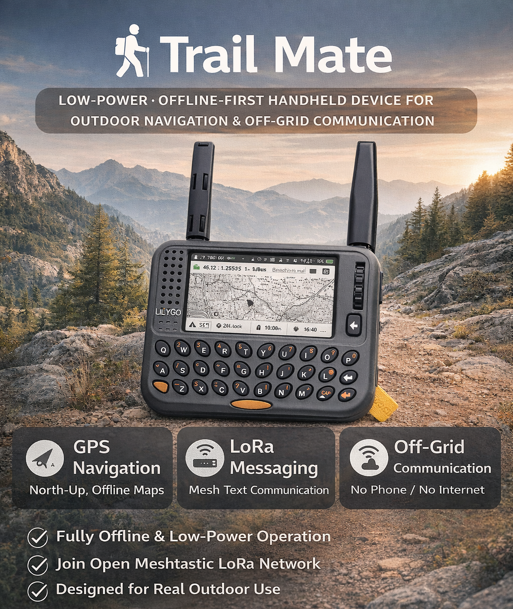

> An edge-first decentralized communication and situational-awareness system where identity, data, and connectivity choices remain with the user

**Trail Mate is a multi-target open-source platform for phone-independent outdoor navigation, off-grid messaging, and team situational awareness. Its shared architecture spans ESP32, nRF52, and Linux, with selectable Meshtastic, MeshCore, and Reticulum/LXMF networking paths.**

[English](README.md) | [Documentation](https://github.com/vicliu624/trail-mate/wiki) | [Releases](https://github.com/vicliu624/trail-mate/releases) | [Join Discord](https://discord.gg/shkueG4zfc)

---

## ⚙️ Engineering Snapshot

- **Platforms:** ESP32 and nRF52 firmware, Linux device applications, and a Linux simulator
- **Networking:** Meshtastic · MeshCore · Reticulum/LXMF, with support depending on the target
- **Hardware:** keyboard handhelds, touch navigation terminals, and low-power message devices
- **Toolchains:** PlatformIO / Arduino · ESP-IDF · CMake for Linux
- **Validation:** multi-target CI builds, native regression tests, LVGL integration tests, architecture boundary checks, stack and runtime-budget checks, and OTA-size validation
- **Releases:** automated firmware packaging, web-flasher images for selected targets, nRF52 UF2 images, and tagged-release debug symbols
- **Core capabilities:** GNSS · offline maps · LoRa messaging · local storage · on-device team awareness
- **License:** [AGPL-3.0](LICENSE)

Capabilities vary with memory, peripherals, input hardware, and port maturity. The simplified nRF52 targets currently provide Meshtastic / MeshCore messaging rather than the full feature set. See the device table below for current status.

Engineering evidence: [CI and release workflow](.github/workflows/ci.yml) · [shared protocol tests](modules/core_chat/tests) · [repository architecture](docs/specification/REPOSITORY_LAYOUT_ARCHITECTURE_SPEC.md) · [version history](CHANGELOG.md).

## 🚀 Try Trail Mate

### Decentralized Geocaching

Create and publish signed caches over Reticulum, browse independently operated directories, and download cache details for offline maps. The [live web map](https://vicliu624.github.io/trail-mate/geocaching/) queries the network directly, so new publications do not require a website update. Publishers keep their own identities; the protocol supports independent directory operators rather than requiring one central service.

Configure network access under **Settings > Reticulum** without changing the chat protocol. Manually configured TCP interfaces support IFAC through the SD configuration; RNode/LoRa and AutoInterface IFAC are still pending. See the [Reticulum settings guide](https://github.com/vicliu624/trail-mate/wiki/4.1.1-Reticulum-Settings) and [Geocaching developer guide](https://github.com/vicliu624/trail-mate/wiki/20.-Geocaching-Developer-Guide).

1. **Choose a device** from the support table below. T-LoRa-Pager SX1262 and T-Deck are the primary validation targets.
2. **Install a matching image** from [Releases](https://github.com/vicliu624/trail-mate/releases), or use the [website and web flasher](https://vicliu624.github.io/trail-mate/) for supported targets. For source builds, see [Build Methods](#build-methods).
3. **Prepare for offline use** with the [Wiki](https://github.com/vicliu624/trail-mate/wiki): configure the selected protocol and radio region, and prepare maps and local storage for your device.

Review the [responsible-use and safety guidance](#responsible-use) before field use.

---

## 🧩 Current Device Support & Development Status

The table below records the **real build targets currently present in the repository and their maturity**.

| Device / Target | Build Target | Stack | Current Status |
| --- | --- | --- | --- |
| **LILYGO T-LoRa-Pager (SX1262)** | `tlora_pager_sx1262` | PlatformIO / Arduino | Current default environment and still the most complete day-to-day validation target |
| **LILYGO T-Deck** | `tdeck` | PlatformIO / Arduino | Primary validation target; keyboard, chat, maps, and shared UI paths are actively used |
| **Seeed Wio Tracker L2 Pro (touchscreen)** | `wio_tracker_l2` | PlatformIO / Arduino (ESP32-S3) | Integrated shared-product port with CI build and LVGL touch regression coverage; see the [target contract](docs/targets/wio_tracker_l2.md) for capabilities and separate on-device acceptance checks |
| **GAT562 Mesh EVB Pro** | `gat562_mesh_evb_pro` | PlatformIO / Arduino (nRF52) | Simplified nRF52 firmware target with monochrome UI, Meshtastic / MeshCore LoRa paths, and persistent on-device radio settings |
| **LILYGO T-Echo-Lite-KeyShield** | `t-echo-lite` | PlatformIO / Arduino (nRF52) | Simplified nRF52 firmware target with 192x176 e-paper UI, 4x5 physical keypad input, Meshtastic / MeshCore LoRa paths, and local device settings |
| **LILYGO T-LoRa-Pager (LR1121)** | `tlora_pager_lr1121` | PlatformIO / Arduino | Supported Pager RF variant with LR1121 RF switch and TCXO bring-up |
| **LILYGO T-Deck Pro** | `tdeck_pro_a7682e` / `tdeck_pro_pcm512a` | PlatformIO / Arduino | Separate environments exist, but this line is still in active bring-up / adaptation work |
| **LILYGO T-Watch S3** | `lilygo_twatch_s3` | PlatformIO / Arduino | Experimental target used more for system and UI validation than for full feature coverage |
| **M5Stack Tab5** | `TRAIL_MATE_IDF_TARGET=tab5` | ESP-IDF | Main large-screen IDF bring-up target; the shared shell runs and hardware-specific work is still being filled in |
| **LILYGO T-Display P4 TFT** | `TRAIL_MATE_IDF_TARGET=t_display_p4_tft` | ESP-IDF | Explicit TFT / HI8561 bring-up target for the shared IDF shell |
| **LILYGO T-Display P4 AMOLED** | `TRAIL_MATE_IDF_TARGET=t_display_p4_amoled` | ESP-IDF | Explicit AMOLED / RM69A10 + GT9895 bring-up target for the shared IDF shell |

Linux development also includes the [Cardputer Zero device app](apps/linux_cardputer_zero/README.md) and [Linux simulator](apps/linux_sim_shell/README.md). These have their own build and validation paths; embedded CI coverage does not establish Linux hardware readiness.

### How To Choose A Target Today

- If you want the most stable daily development path right now, start with **`tlora_pager_sx1262`** or **`tdeck`**
- If you are debugging a resource-constrained simplified nRF52 target, start with **`gat562_mesh_evb_pro`** or **`t-echo-lite`**
- If you are working on the newer large-screen ESP-IDF path, start with **`tab5`**
- **`tdeck_pro_*`**, **`lilygo_twatch_s3`**, **`t_display_p4_tft`**, and **`t_display_p4_amoled`** are better treated as bring-up, layout, or device-adaptation targets than as the highest-maturity feature-validation path
- A build target establishes that the device is present in the repository; the table's status column records page and capability maturity. Features may be enabled or hidden dynamically according to capabilities, RAM budget, and input hardware
- [GitHub Actions](.github/workflows/ci.yml) builds **`wio_tracker_l2`**, **`tlora_pager_sx1262`**, **`tlora_pager_lr1121`**, **`tdeck`**, **`lilygo_twatch_s3`**, **`gat562_mesh_evb_pro`**, and the nRF52 wrapper target **`t-echo-lite`**, plus the ESP-IDF **P4 TFT**, **P4 AMOLED**, and **C6 companion** targets; GAT562 and T-Echo-Lite release artifacts include UF2 files for manual flashing, verified with the nRF52840 UF2 family ID `0xADA52840`

---

## 🏗️ Shared Architecture & Protocol Interoperability

Trail Mate carries shared messaging, storage, navigation, and UI/business capabilities across device families. The repository separates reusable [modules](modules), [platform adapters](platform), [board definitions](boards), and [application shells](apps), with responsibilities documented in the [architecture specification](docs/specification/REPOSITORY_LAYOUT_ARCHITECTURE_SPEC.md).

Meshtastic, MeshCore, and Reticulum/LXMF are selectable network paths within that product model. A device runs one explicit product protocol path at a time; this does not imply automatic bridging between the three networks or complete upstream feature parity. On-device TAK means Trail Mate's own team-awareness capabilities; ATAK, WinTAK, and CoT interoperability are outside the current claim.

Maintaining this shared product involves protocol compatibility, different radio and display drivers, constrained RAM and task stacks, storage ownership, UI behavior, and release images across targets. The [CI workflow](.github/workflows/ci.yml) makes these concerns visible through build matrices and targeted regression and contract checks.

## 🔒 Security & Reliability

Trail Mate handles input from radio, network, Bluetooth, serial, USB, and removable storage. Protocol parsing, identity and key handling, persistence, and shared hardware access are security-sensitive boundaries.

The repository includes tests for [control-frame authentication and corruption rejection](modules/core_chat/tests/test_vmp_control_auth.cpp), [media-frame integrity](modules/core_chat/tests/test_vmp_media_frames.cpp), [duplicate and malformed shard rejection](modules/core_chat/tests/test_vmp_receive_block.cpp), and [voice-inbox persistence](modules/core_chat/tests/test_vmp_voice_inbox.cpp). CI also checks storage transactions, bounded map delivery, ESP stack hygiene, Wi-Fi access policy, and Reticulum runtime budgets. These checks provide specific regression evidence, not a claim of a completed security audit.

See [SECURITY.md](SECURITY.md) to report a suspected vulnerability privately.

---

## 📋 Why Trail Mate Exists


Humanity has never possessed a greater capacity to connect, yet the authority to establish a connection is becoming increasingly concentrated. Accounts determine whether an identity exists. Applications hold the relationships between people. Platforms decide whether information can arrive. Location, searches, reading, conversations, and movement accumulate into digital records that can become more complete than a person's memory and more influential than a person's own explanation.

When communication gateways, identity systems, accumulated data, and interpretive authority converge in a few centers, convenience gradually becomes governing power. Algorithms begin to decide who is visible, who is suspicious, who receives an opportunity, and who is excluded. Those decisions disappear into models, policies, and risk scores where responsibility is difficult to identify and appeal is difficult to reach. Countless local choices made in the name of efficiency can accumulate into a vast and silent algorithmic bureaucracy.

**Decentralization returns the authority to establish digital life to the individual.** A person can generate and hold an identity. Contacts can remain in personally controlled storage. Messages can move directly between devices. Position can be shared only with recipients selected by the user. Changing platforms leaves identity intact. A discontinued service leaves human relationships intact. Infrastructure failure leaves people with the ability to communicate and coordinate.

**Trail Mate turns that authority into a system people can hold.** It runs on personally held embedded devices and Linux portable terminals, keeping identity, contacts, messages, position, maps, and tracks on the user's devices. Meshtastic, MeshCore, and Reticulum provide selectable decentralized network paths. Offline maps and on-device TAK capabilities keep navigation, situational awareness, and team coordination available beyond the public Internet.

Trail Mate is something close to a decentralized phone. Users hold their data directly, choose their connection paths, and can understand every sharing relationship. Links may be narrow, device resources may be constrained, and the environment may be completely off-grid; identity, communication, navigation, and coordination remain in human hands.

> **Connection is a capability people can hold. Trail Mate keeps that capability in the hands of each user.**

## 🧭 Product Position

Trail Mate is organized around four defining capabilities:

* **Anonymous operation**: device identity exists independently of cloud accounts and phone numbers. The system reduces unnecessary public discovery, identity linkage, and location exposure. Anonymous operation has explicit technical limits, and the user still applies security judgment to the surrounding environment.
* **Decentralized communication**: Meshtastic, MeshCore, and Reticulum provide three selectable product network paths. Identity and contacts can exist independently of any single platform, messages can travel through the network selected by the user, and the loss of one path cannot claim ownership of the whole system. The device runs one explicit protocol path at a time, keeping network membership and behavior understandable.
* **Offline operation**: input, viewing, configuration, maps, contacts, messages, and tracks can be handled on the device. Phone and desktop tools provide optional extensions while control remains at the edge.
* **TAK capability**: the device provides member, position, waypoint, track, status, and team-message awareness. Trail Mate's current TAK claim covers its own on-device team-awareness capability. ATAK, WinTAK, and CoT interoperability sit outside the present claim.

The system models public discovery position, contact position, Team position, and local tracks as four distinct data relationships. Users should be able to confirm the shared content, its recipients, and the network path used.

<a id="responsible-use"></a>

## ⚖️ Responsible Use, Legal Compliance, and Scope

Trail Mate is an assistance system for hiking, camping, trail running, and
other outdoor activities. Its purpose is to help people share positions,
coordinate with a group, maintain safety contact, and seek assistance when
normal connectivity is limited or unavailable.

Trail Mate is not intended to serve anyone who harms, controls, surveils,
harasses, or stalks others, or who engages in any other unlawful activity.
Use this device and its software only for lawful, legitimate purposes that
respect the rights, safety, and privacy of others.

The product boundary is deliberate: Trail Mate focuses on helping people stay
in contact and obtain assistance during outdoor activities. It is not a
general-purpose radio experimentation platform or a complete communication
protocol terminal. Features unrelated to outdoor activity, safety
coordination, or assistance—and especially features aimed primarily at radio
operation, network administration, or other non-outdoor uses—are outside the
scope of this project.

### Legal compliance

Before using Trail Mate, understand and comply with every applicable law,
regulation, and local requirement where it is used. This includes, but is not
limited to:

* Radio-spectrum rules, including permitted frequencies, transmit power,
  transmission duration, and duty-cycle limits
* Radio-equipment approval, licensing, registration, or amateur-radio operator
  requirements
* Rules set by countries, regions, parks, protected areas, campsites, and
  event organizers
* Privacy, personal-data, location-data, and communication-content protections
* Restrictions governing emergency, public-safety, and other protected
  communications

Requirements vary substantially by country and region. A feature being
technically capable of operating does not mean it is lawful to use in a given
location. Each user is responsible for ensuring that their device
configuration, frequency plan, transmit power, and operating practice comply
with local requirements.

Do not use Trail Mate, derivative devices, software, or networks for illegal
activity. This includes unauthorized interception, tracking, or location of
people; privacy violations; harassment; fraud; regulatory evasion;
interference with lawful radio communications; or assisting anyone in harming
others.

### Meshtastic and MeshCore interoperability

Trail Mate integrates selected Meshtastic and MeshCore protocol capabilities
so that outdoor users can establish the necessary interoperability with people
running their official firmware. The intended use is outdoor coordination,
safety contact, and seeking or offering assistance when conventional network
coverage is absent or unreliable.

Trail Mate does not aim to implement every Meshtastic or MeshCore feature, nor
to replace their official firmware, clients, or ecosystems. It implements only
the capabilities that fit Trail Mate's purpose of outdoor assistance,
coordination, and safety contact.

Features without a direct relationship to outdoor activities and safety
communication—particularly those focused on radio experimentation, network
administration, general-purpose communication extensions, or other
non-outdoor uses—are not planned for implementation. This is a product-scope
decision, not a judgment on Meshtastic, MeshCore, their communities, or their
respective feature directions.

Meshtastic and MeshCore names, software, protocols, and related materials
belong to their respective owners and communities. Compatibility or
interoperability with those projects does not imply their endorsement,
approval, or official support of Trail Mate.

### Safety notice

Trail Mate can support outdoor activities, but it cannot replace thorough trip
planning, route preparation, weather assessment, navigation skills, first-aid
knowledge, group coordination, or professional rescue equipment.

In remote, high-risk, extreme-weather, or otherwise unreliable communication
environments, do not treat Trail Mate as your only life-safety measure. Choose
appropriate additional equipment for the activity, such as maps and a compass,
backup power, first-aid supplies, a whistle, satellite communications, or a
personal locator beacon, and share your itinerary with a reliable contact
before departure.

## 🔒 Frozen Embedded-Firmware Boundary

The major feature set of Trail Mate's current embedded firmware is now defined. Its future scope consists of the existing feature domains, the three Meshtastic/MeshCore/Reticulum product protocols, and the four core capabilities of anonymous operation, decentralization, offline operation, and TAK. This boundary applies specifically to the embedded firmware product surface. Trail Mate as a whole also includes the Linux version and other edge-device forms.

Ongoing work focuses on bug fixes, reliability and security, protocol interoperability correctness, resource efficiency, carrying the existing product on suitable hardware, test tooling, and documentation. New board ports carry the established capabilities onto suitable devices.

---

## ✨ Core Features

### 🧭 Main Menu Overview

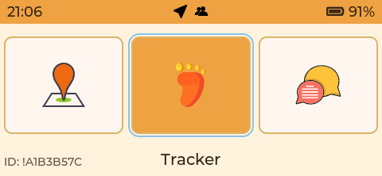

The main menu provides quick access to GPS, LoRa chat, tracker, and system utilities,
designed for fast navigation on a physical keyboard without deep menu nesting.


### 🧭 GPS Map (Performance-First)

| Layer Menu | OSM Base Map |
| --- | --- |
| 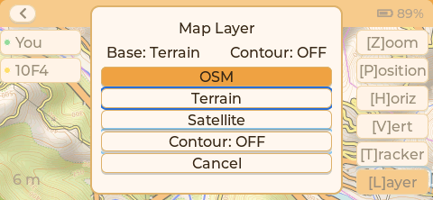 | 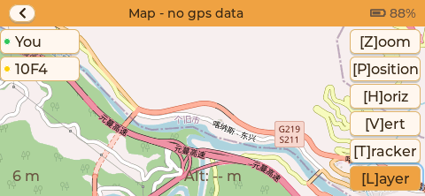 |

| Terrain Base Map | Satellite Base Map |
| --- | --- |
| 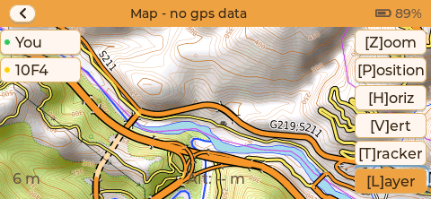 | 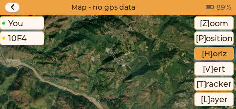 |

* Fixed **North-Up** map orientation (no rotation)
* Fully **offline** map rendering from SD card tiles
* Three switchable base layers: **OSM / Terrain / Satellite**
* Optional contour overlay for terrain shape awareness
* Real-time position marker for the current GPS fix
* Discrete zoom levels optimized for embedded systems
* Simple breadcrumb trails for path awareness
* Fast in-page layer switching via map layer menu (no page restart)

#### Node inspection from the map


Select a discovered node directly on the map to inspect its protocol, last-seen state, zoom level, coordinates, and surrounding offline-map context without leaving the situational view.

Expected SD card tile layout:

```text
/maps/base/osm/{z}/{x}/{y}.png
/maps/base/terrain/{z}/{x}/{y}.png
/maps/base/satellite/{z}/{x}/{y}.png
/maps/contour/major-500/{z}/{x}/{y}.png
/maps/contour/major-200/{z}/{x}/{y}.png
/maps/contour/major-100/{z}/{x}/{y}.png
/maps/contour/major-50/{z}/{x}/{y}.png
/maps/contour/major-25/{z}/{x}/{y}.png
```

### 🛰️ GNSS Sky Plot

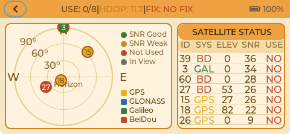

* Real-time sky plot of visible satellites (azimuth/elevation)
* SNR status and constellation coloring (GPS/GLONASS/Galileo/BeiDou)
* Clear indication of satellites used in the current fix
* Summary of USE/HDOP/FIX for fast diagnostics

### 📡 Protocol Probe (LoRa Profile Discovery)

Protocol Probe finds complete LoRa air profiles carrying real Trail Mate
protocol traffic. It is not an RSSI spectrum analyser and never calls a quiet
frequency a usable protocol channel.

* Starts with the active profile and finite protocol-derived candidates instead of a generic 25 kHz frequency grid
* MeshCore uses Discover and a valid response/ACK for active confirmation
* Meshtastic passively discovers a target node, then uses a keyed unicast `want_ack` check when available
* Reticulum records only self-consistent public Announce or control Path Request traffic; it remains passive and does not claim confirmation in this temporary tuning flow
* Lists only `OBSERVED` and `CONFIRMED` profiles, with evidence counts but no business-packet labels
* Lets the user apply a selected observed/confirmed profile only after explicit confirmation

See [the Protocol Probe specification](docs/EnergySweep/function.md) for the
evidence model and protocol-specific boundaries.

### 📡 Decentralized Messaging (Meshtastic / MeshCore / Reticulum)

| Conversation | Reticulum Peer |
| --- | --- |
|  |  |

Messages view shows recent conversations and history for quick review.

* Three selectable product protocols: Meshtastic, MeshCore, and Reticulum
* Reticulum mode uses an on-device Reticulum/LXMF runtime and can carry traffic over configured LoRa, AutoInterface, or TCP gateway interfaces
* Reticulum peer details expose the display name, LXMF address, and identity hash needed to verify and manage decentralized identities
* Chinese text support
* Compatible with the **Meshtastic public mesh** (LongFast/PSK)
* Compatible with **MeshCore networks** (native MeshCore packet path)
* Bluetooth connectivity to Meshtastic / MeshCore companion apps
* Designed for high latency, low bandwidth, and packet-loss environments
* Contacts, conversations, and messages are persisted on-device; the SD card is the configuration source for Reticulum networking and its editable contact directory

For the Reticulum SD-card format, file locations, contact import, and on-device operations, see the [Reticulum Mode User Guide](https://github.com/vicliu624/trail-mate/wiki/3.5-Configuration-Guide).

### ☁️ Mesh MQTT (Meshtastic / MeshCore)


Trail Mate can bridge both Meshtastic and MeshCore traffic through a configurable MQTT broker when Internet or gateway connectivity is available. Each protocol has independent enable, uplink, downlink, host, port, root-topic, and credential settings. Meshtastic ships with its ecosystem defaults; MeshCore ships disabled with the public `test.mosquitto.org:1883` test broker and `meshcore` root as editable starter values. The public broker is intended for evaluation only—field and production deployments should use a private or self-hosted broker.

### 🌐 Nomad Network

| Micron Page Rendering | Engine & Link Semantics |
| --- | --- |
|  |  |

| Offline Form State | Compatibility Diagnostics |
| --- | --- |
|  |  |

Nomad Network renders Reticulum Micron pages directly on the device. The embedded browser supports navigable links, constrained layout primitives, forms, cached/offline-ready state, and visible compatibility diagnostics for unsupported or unknown Micron constructs. It keeps small information services reachable over Reticulum without depending on a conventional web browser or the public Internet.

### 📷 SSTV Receiver (Slow-Scan TV)

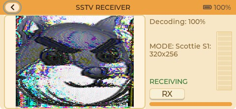


* Receive SSTV audio and decode to images on-device
* Real-time decode progress and image preview
* Designed for low-power, embedded decoding

### 👥 Contacts

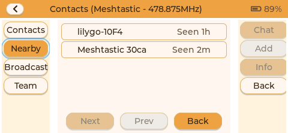

Contacts is a persistent on-device communication directory. It combines discovered and user-maintained contacts, recent activity, and protocol identities, with quick access to direct messaging, calls, ping, or team actions when supported by the active protocol and hardware.

On keyboard-equipped interfaces, press `S` to search contacts. Contacts may also be saved from discovery results or added in bulk by editing the Reticulum contact file on the SD card. The Wiki guide above documents the full key and file workflow.

### 💻 Data Exchange (PC Link)

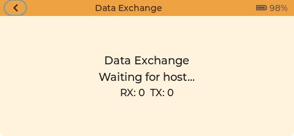

PC Link connects the device to a host computer and exposes a structured HostLink stream
for real-time APRS/iGate integration, diagnostics, and data capture.

* Live forwarding of LoRa messages, team updates, and GPS snapshots
* APRS-oriented metadata for external gateways and dashboards
* USB CDC-ACM transport with deterministic framing

### 🖥️ Trail Mate Center

[Trail Mate Center](https://github.com/vicliu624/trail-mate-center) is the desktop-side control center for Trail Mate and Meshtastic-compatible field devices connected through USB HostLink. Its Avalonia interface combines live maps, nodes, teams, event streams, messaging, device configuration, replay, protocol inspection, and data export in one application.

It also prepares offline OSM, terrain, satellite, and contour-map regions for removable media; can build a buffered cache around imported KML routes; and provides a propagation workbench for coverage, interference, relay placement, calibration, and result export. Trail Mate Center is maintained as a separate desktop repository and does not contain the embedded firmware.

### 🤝 TAK / Team Mode (ESP-NOW Pairing + LoRa Ops)

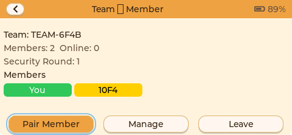

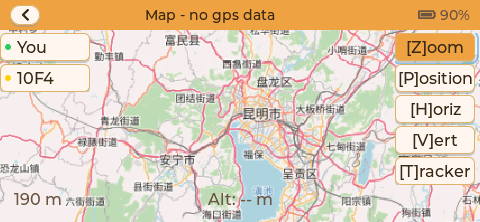

Team mode is designed for small groups that are physically together.
Pairing happens over ESP-NOW at close range to exchange a team key,
then all team operations run over LoRa.

* Create a team (leader) or join a nearby team (member)
* Secure key distribution and team ID establishment during pairing
* Team chat (text/location) and shared status updates
* Member list with leader/member roles and counts
* Team waypoint / assembly-point sharing
* Team map view with latest member positions and track snapshots

### 🧭 Track Recording & Route Following

| Step 1 — Elevation & Route Overview | Step 2 — Waypoint Image Preview |
| --- | --- |
|  |  |

* Track recording and storage (record/route modes)
* Track list browsing and route focus
* KML route overlay support
* Two-stage route preview: inspect the full elevation profile first, then page through georeferenced remote images and their positions along the route
* Route preview progress, saved-image counts, distance, and load state remain visible on the embedded display
* GPX tracks exportable via USB Mass Storage

### 🎙️ Walkie Talkie

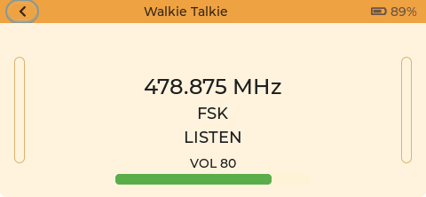

* FSK + Codec2 voice walkie talkie
* Half-duplex PTT (press to talk / release to listen)
* Jitter buffering and fixed playback cadence for stability

---
## 💡 Non-Negotiable Design Principles

* **Edge ownership**: identity, contacts, messages, configuration, maps, and tracks belong first to the person holding the device.
* **Explicit data relationships**: protocols, contact relationships, and position purposes remain distinct and visible to the user.
* **Honest uncertainty**: the interface directly presents link failure, stale position, and unknown state, and displays success only after obtaining evidence of success.
* **Predictable degradation**: when a network, phone, cloud service, or hardware capability is absent, the independently useful parts of the system remain available.
* **Long-term reliability on constrained hardware**: resource efficiency, determinism, and maintainability take priority over feature accumulation and visual spectacle.

---

## 📱 Hardware-Carriage Strategy

Trail Mate's hardware work focuses on devices suited to carrying the established product capabilities. This section describes the **hardware-selection direction**. The [build-target table above](#-current-device-support--development-status) records current implementation maturity. New hardware continues to carry the defined product domains.

Current priority device categories include:

- **Keyboard-first LoRa handhelds** such as `T-LoRa-Pager`, `T-Deck`, `T-Deck Pro`, and `Cardputer`-style devices, where users can enter free-form text directly without depending on a phone
- **Large-screen touch navigation terminals** such as `M5Stack Tab5` and `T-Display P4`, which are better suited to maps, team situational awareness, and HostLink / companion-computer workflows
- **Ultra-low-power / small-screen message terminals** such as tighter `nRF52 + SX1262` class devices, where monochrome UI, status viewing, simplified chat, and BLE bridging matter more than feature breadth

When evaluating hardware, the project currently prioritizes:

- Reliable LoRa / Sub-GHz radio capability, or at least a clear path to integrate it cleanly
- A device that can handle basic input, viewing, and configuration independently, with phones serving as optional extensions
- Reasonable power, battery, and field portability characteristics
- A stable enough ecosystem, documentation base, or supply chain to justify long-term maintenance

The project stays as **hardware-agnostic** as practical. Protocol logic, storage, and UI/business behavior remain decoupled from board-specific code. Embedded and Linux targets share the established Meshtastic, MeshCore, Reticulum, and TAK capabilities and retain one product model.

---

<a id="build-methods"></a>

## 🛠️ Build Methods

Trail Mate currently uses two main toolchain paths: **PlatformIO** and **ESP-IDF**. The commands below are intended to be run from the **repository root**.

### PlatformIO

PlatformIO covers both the ESP32 Arduino targets and the current nRF52 Arduino targets. The root [platformio.ini](platformio.ini) keeps only shared configuration, while the actual target environments live under `variants/*/envs/*.ini`.

Common build commands:

```bash
# Primary targets
platformio run -e tlora_pager_sx1262
platformio run -e tlora_pager_lr1121
platformio run -e tdeck

# nRF52 / simplified targets
platformio run -e gat562_mesh_evb_pro
platformio run -d builds/pio_nrf52 -e t-echo-lite

# Other integrated targets
platformio run -e wio_tracker_l2
platformio run -e tdeck_pro_a7682e
platformio run -e tdeck_pro_pcm512a
platformio run -e lilygo_twatch_s3
```

If you want more verbose diagnostics, the repository also provides these debug environments:

```bash
platformio run -e tlora_pager_sx1262_debug
platformio run -e tdeck_debug
platformio run -e lilygo_twatch_s3_debug
```

Generic upload form:

```bash
platformio run -e <env> --target upload
```

If you need to select the serial port explicitly, add `--upload-port COMx`. For example:

```bash
platformio run -e tlora_pager_sx1262 --target upload --upload-port COM6
```

Notes:

- Running `platformio run` with no explicit environment uses the root default environment, currently **`tlora_pager_sx1262`**
- If you only want to sanity-check whether a target still builds, start with **`tlora_pager_sx1262`**, **`tdeck`**, **`gat562_mesh_evb_pro`**, or **`t-echo-lite`**
- For very tight-RAM nRF52 simplified targets such as GAT562 and T-Echo-Lite-KeyShield, use release-like or low-log validation and enable extra debug output only for a specific diagnostic need

### ESP-IDF

ESP-IDF is currently used mainly for the newer shared-shell path. The officially wired targets right now are `tab5`, `t_display_p4_tft`, and `t_display_p4_amoled`. The repository root already contains the top-level `CMakeLists.txt`, so you can invoke `idf.py` directly from the root directory.

`tab5` example:

```bash
idf.py -B build.tab5 -DTRAIL_MATE_IDF_TARGET=tab5 reconfigure build
idf.py -B build.tab5 -DTRAIL_MATE_IDF_TARGET=tab5 -p COM6 flash
idf.py -B build.tab5 -DTRAIL_MATE_IDF_TARGET=tab5 monitor
```

`t_display_p4_tft` example:

```bash
idf.py -B build.t_display_p4_tft -DTRAIL_MATE_IDF_TARGET=t_display_p4_tft reconfigure build
idf.py -B build.t_display_p4_tft -DTRAIL_MATE_IDF_TARGET=t_display_p4_tft build
```

`t_display_p4_amoled` example:

```bash
idf.py -B build.t_display_p4_amoled -DTRAIL_MATE_IDF_TARGET=t_display_p4_amoled reconfigure build
idf.py -B build.t_display_p4_amoled -DTRAIL_MATE_IDF_TARGET=t_display_p4_amoled build
```

### Notes

- ESP-IDF generated `sdkconfig` state now lives inside the selected build directory such as `build.tab5`, `build.t_display_p4_tft`, or `build.t_display_p4_amoled`, giving every target isolated configuration output
- For **Tab5**, prefer running `monitor` separately after flashing; chaining `flash monitor` can leave ESP32-P4 in ROM download mode after auto-reset
- VS Code already provides split **Tab5**, **T-Display-P4 TFT**, and **T-Display-P4 AMOLED** `Reconfigure / Build / Flash / Monitor` tasks via `tools/vscode/run_idf_task.ps1`
- If your goal is release validation or routine regression checks, prefer the main PlatformIO path that CI already covers; ESP-IDF targets are still more useful for board bring-up and shared-shell evolution

---

## 🌐 Documentation Language

English documentation is maintained in this repository.

---

## 📝 Changelog

See [CHANGELOG.md](CHANGELOG.md) for version history. The [Roadmap](https://github.com/vicliu624/trail-mate/wiki/16.-Roadmap) records the established product direction and maintenance boundary.

---

## 📄 License

This project is licensed under the **GNU Affero General Public License v3.0 (AGPLv3)**.

The license is intended to ensure that:

* Source code remains available when the project is modified, deployed, or offered as a network service
* The core system cannot be incorporated into closed-source or proprietary products without authorization

### Commercial Licensing

A separate **commercial license** may be provided for the following use cases:

* Commercial or closed-source products
* Hardware vendors integrating or pre-installing the firmware
* Commercial applications unable or unwilling to comply with AGPLv3

For such use cases, please contact the project author to discuss licensing terms.
Publication of this repository does **not** grant any default commercial rights.

See the [LICENSE](LICENSE) file for details.

---

## 🔐 Project Scope

This repository contains Trail Mate's open-source edge-device implementations, including:

* Embedded firmware for ESP32-, nRF52-, and related targets
* Linux portable-terminal applications and shared UI/business capabilities
* Offline maps, positioning, tracks, and on-device TAK capabilities
* Meshtastic, MeshCore, and Reticulum/LXMF communication paths and local storage
* HostLink, board integrations, tests, and development tooling

This project **does not include**:

* Separately distributed commercial desktop software
* Mobile applications (iOS / Android)
* Commercial services or platform products

Any surrounding tools or services may follow different licensing strategies and are outside the scope of this repository.

---

## 🤝 Contributing

Trail Mate's embedded product boundary is now defined. Contributions focus on making the existing capabilities more trustworthy, understandable, and usable on real devices.

### Contribution & Copyright

Unless explicitly stated otherwise, all contributions to this repository are released under the **AGPLv3 license**.

The project is currently author-driven and does not accept contributions that alter core architecture or licensing terms.
For commercial collaboration or deep involvement, please contact the author directly.

The most useful contributions include:

* Private vulnerability reports through [SECURITY.md](SECURITY.md)
* Reproducible defect reports with device, firmware, protocol, network conditions, and exact steps
* Real test results from off-grid, weak-link, low-power, and harsh environments
* Interoperability verification against upstream Meshtastic, MeshCore, and Reticulum/LXMF implementations
* Measurements of power, memory, storage, concurrency, and long-running behavior
* Reliability, security, hardware-port, test, and documentation improvements that preserve the product boundary
* Specific reports of misleading status, unclear operations, or ambiguous privacy boundaries

Pull Requests remain welcome, but changes to the core architecture, product boundary, or licensing strategy should be discussed with the author first. Even without code, a report that clearly states the conditions, action, expected result, and actual result is valuable.

> **Every existing Trail Mate promise should be worthy of trust.**

---

## ✅ Current Capability Index

This section provides a searchable implementation index. The [Trail Mate Wiki](https://github.com/vicliu624/trail-mate/wiki) is the user-documentation source for configuration, keyboard shortcuts, file formats, and operational procedures.

### 🧭 GPS Navigation & Tracks

- Offline map rendering (north-up, no rotation)
- Runtime base layer switching: OSM / Terrain / Satellite
- Contour overlay toggle in map layer menu
- SD tile layout support for OSM/Terrain PNG and Satellite JPG
- Real-time position marker and coordinate display
- Discrete zoom levels and low-power tuning
- Track recording and route modes (record/route list)
- KML route overlays and focus
- GPX tracks exportable via USB Mass Storage

### 📝 Decentralized Messaging (Meshtastic / MeshCore / Reticulum)

- LoRa text messaging with Chinese support
- Meshtastic public mesh compatibility (LongFast/PSK)
- MeshCore network compatibility (native MeshCore packet path)
- On-device Reticulum/LXMF runtime with LoRa, AutoInterface, and TCP gateway interfaces
- SD-card-based Reticulum configuration and editable contact directory
- Bluetooth connectivity to Meshtastic / MeshCore companion apps
- Message history and conversation list
- Routing confirmations and reliability diagnostics
- Unishox2 decompression for incoming messages

### 🤝 TAK / Team Mode (ESP-NOW Pairing + LoRa Ops)

- Close-range ESP-NOW pairing with key distribution and team ID setup
- Member list and leader/member roles
- Team chat (text/location)
- Team map view with member position updates
- Team waypoint / assembly-point sharing
- Team track and status rebroadcast

### 📷 SSTV Receiver (Slow-Scan TV)

- SSTV audio reception and on-device image decoding
- Real-time decode progress and image preview
- Lightweight pipeline for low-power hardware

### 👥 Contacts

- Node discovery and contacts list
- Node metadata (ID/short name/device info)
- Online/offline status and recent activity
- Quick jump to direct or team conversations

### 💻 Data Exchange (PC Link / HostLink)

- USB CDC-ACM transport
- HostLink frames/events/config support
- Live forwarding of LoRa/team/GPS data
- APRS/iGate-oriented metadata output

### 🎙️ Walkie Talkie

- FSK + Codec2 voice walkie talkie
- Half-duplex PTT (press to talk / release to listen)
- Jitter buffering and fixed playback cadence

### ⚙️ System Settings & Status

- Display/sleep controls and basic settings
- GPS and network-related configuration
- Status bar icons and system notifications
- Screenshot capture (ALT double-press, saved to SD /screen)

### 💾 USB Mass Storage

- Device mounts as a USB drive
- Direct management of exported tracks and files

### 🔌 System Management

- Graceful shutdown
- Low-power management
- Runtime status monitoring

### 📻 Trail-mate Simplified Edition (nRF52 / GAT562 Mesh EVB Pro / T-Echo-Lite-KeyShield)

- The simplified edition currently supports two nRF52 devices: `GAT562 Mesh EVB Pro` and `T-Echo-Lite-KeyShield`
- It already covers Meshtastic and MeshCore dual-protocol LoRa RX/TX, including Text / NodeInfo / Position handling and the corresponding persistence paths
- Device-side protocol switching and Meshtastic / MeshCore air-parameter editing are available for standalone operation without relying on a phone app
- Device-side parameters can already be edited locally and persisted
- The monochrome UI can be used to view time, GPS, and radio status

---
## 🙏 Acknowledgements

Trail Mate has benefited from real support from the community and hardware vendors.

- Special thanks to **LILYGO** for providing development hardware.
  Their open hardware ecosystem and stable ESP32 product line have enabled continuous iteration and validation in real devices.

- Special thanks to **M5Stack** for supporting the Cardputer Zero adaptation with hardware support.
  Their support helped validate the Cardputer Zero environment against real device constraints and move Trail Mate's Linux portable-device path forward.

- Special thanks to **[Seeed Studio](https://www.seeedstudio.com/)** for supporting Trail Mate with development hardware.
  Their support helps broaden device compatibility and enables continued development and validation on real hardware.

- Special thanks to **Shenzhen GAT-IOT Technology Co., Ltd.** (https://github.com/gat-iot) for providing hardware support to this project.
  The real devices they supplied have helped Trail Mate carry out development, debugging, and validation on actual hardware, further advancing the implementation and refinement of related features.

These contributions lowered the barrier to prototyping and allowed Trail Mate to receive real-world feedback much earlier.

If other hardware vendors resonate with the project's design philosophy and wish to explore its potential in offline outdoor scenarios, feel free to get in touch.
When feasible, I am happy to adapt the software to additional devices and provide feedback based on real usage.


Special thanks to **dawsonjon** (https://github.com/dawsonjon) for the open-source **PicoSSTV** project:
https://github.com/dawsonjon/PicoSSTV. Our SSTV receiver borrows from its decoding approach.
For algorithm details, see: https://101-things.readthedocs.io/en/latest/sstv_decoder.html

---

**Built with care for the outdoor community ❤️**

# NOTICE

## About This Project

**Trail Mate** is an edge-first personal communication and situational-awareness system designed for anonymous operation, decentralization, and offline use. It runs on personally held embedded devices and Linux portable terminals, using Meshtastic, MeshCore, Reticulum, and on-device TAK capabilities for communication, position, navigation, and coordination.

Trail Mate makes the Internet an optional connectivity resource and places basic communication directly on personally held devices. Identity, contacts, messages, position, maps, and tracks remain as close as possible to the user, with explicit relationships and choices whenever data is shared.

This repository is an actively developed and maintained engineering project containing practical implementations for evaluation, porting, integration, and deployment.

If you are evaluating, integrating, porting, modifying, or using this codebase in any product, research, deployment, or internal tooling — you are encouraged to contact the author.

---

## Author

**Vic Liu**

The system architecture, communication protocols, embedded firmware, Linux edge implementation, and reference implementations are primarily maintained by the original author.

---

## Contact

* Email: **[vicliu@outlook.com](mailto:vicliu@outlook.com)**
* Discord community: **[Trail Mate Discord](https://discord.gg/shkueG4zfc)**
* Discord personal contact: **`vicliu_63660`** — add this username as a friend in Discord.
* WeChat: **vicliu890624**

You may contact me for:

* Hardware adaptation or porting
* Protocol clarification
* Integration into existing radio systems
* Commercial licensing discussions
* Collaboration or joint development
* Field deployment guidance
* Bug reports that are difficult to describe via Issues

Discord or WeChat is preferred for real-time technical discussion.
Email is preferred for formal or long-form communication.

---

## For Organizations / Companies

If your organization is testing or evaluating this repository internally:

You are welcome to reach out even if you are only in the research or feasibility stage.
Early technical discussion usually saves significant engineering time.

Customization, hardware adaptation guidance, and technical consulting are available.

---

## Licensing Reminder

This project is open-source and distributed under the terms specified in the LICENSE file.

If you are using the code in a network service, device firmware distribution, or any redistributable system, please ensure that your usage complies with the license requirements.

If you are unsure, please contact the author before deployment.

---

## Intent

Trail Mate aims to reduce the number of centers a person must trust in order to communicate, navigate, and coordinate. It provides autonomy with explicit, verifiable boundaries: the device remains with its user and continues to work when cloud accounts, phone applications, and stable public networks are all absent.

The embedded feature surface is now defined. Defect reports, interoperability testing, field validation, deployment experience, and improvements to reliability, security, resource efficiency, hardware carriage, and documentation clarity are especially welcome.

You are not required to open Issues before contacting the author directly.

Thank you for taking the time to examine and use this project.
