# 🗺️ Trail Mate

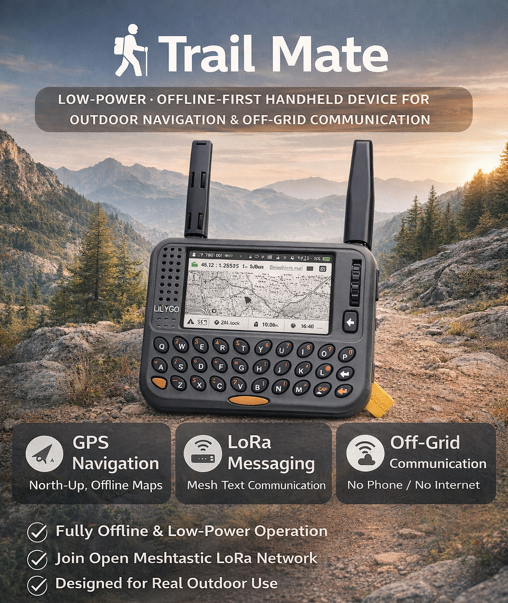

> 面向户外导航与通信的低功耗、离线优先手持设备

[English](README.md) | [中文](README_CN.md) | [加入 Discord 社区](https://discord.gg/87PVMVUP)

---

## 📋 项目介绍


户外活动往往发生在蜂窝网络不稳定甚至完全缺失的环境中。  
在这样的场景下，人们依然需要 **发送简短的文本信息、了解彼此的位置关系，并保持基本的方向感**，而不应完全依赖智能手机或复杂的基础设施。

**Trail-mate** 是一个基于 ESP32 级硬件的低功耗、离线优先手持设备项目，正是为了解决这些问题而设计的。

它聚焦于户外离线场景中的两个核心需求：

- **简单且可靠的自身定位**，通过固定北向上的 GPS 地图，避免不必要的视觉复杂性  
- **基于 LoRa 的直接文本通信**，允许用户 **在不依赖智能手机的情况下** 向 Meshtastic 或 MeshCore Mesh 网络发送自由文本消息  

Trail-mate 将 **稳定性、效率与互操作性** 置于功能堆叠与视觉效果之上，适合在受限硬件条件下进行长时间的户外使用。

---

## ✨ 核心功能

### 🧭 主菜单概览

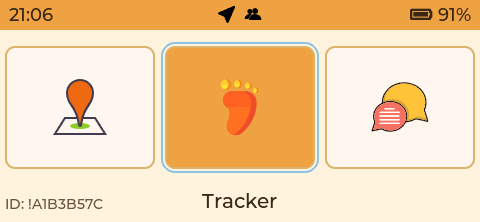

主菜单提供 GPS、LoRa 聊天、Tracker 和系统工具的快捷入口，
适配实体键盘，减少深层菜单跳转。


### 🧭 GPS 地图（性能优先）

| 图层菜单 | OSM 底图 |
| --- | --- |
| 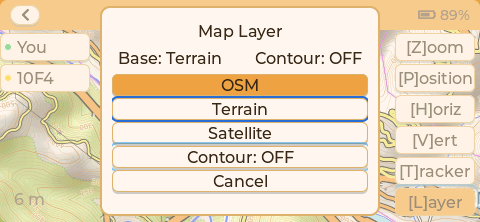 | 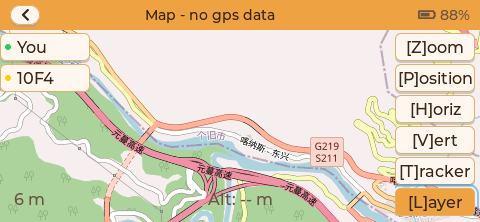 |

| Terrain 底图 | Satellite 底图 |
| --- | --- |
| 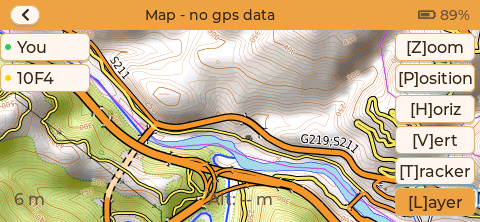 | 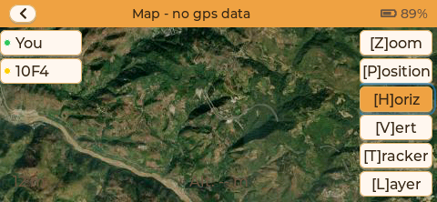 |

- 固定 **北向上（North-Up）** 地图方向（不旋转）
- 基于 SD 瓦片的完全离线地图渲染
- 支持三种可切换底图：**OSM / Terrain / Satellite**
- 支持等高线叠加开关，便于判断地形起伏
- 实时定位标记（当前 GPS 位置）
- 适合嵌入式系统的离散缩放级别
- 简单的面包屑轨迹记录，用于路径感知
- 通过地图图层菜单可即时切换，无需离开当前页面

SD 卡瓦片目录结构示例：

```text
/maps/base/osm/{z}/{x}/{y}.png
/maps/base/terrain/{z}/{x}/{y}.png
/maps/base/satellite/{z}/{x}/{y}.jpg
/maps/contour/major-500/{z}/{x}/{y}.png
/maps/contour/major-200/{z}/{x}/{y}.png
/maps/contour/major-100/{z}/{x}/{y}.png
/maps/contour/major-50/{z}/{x}/{y}.png
/maps/contour/major-25/{z}/{x}/{y}.png
```

### 🛰️ GNSS Sky Plot（卫星天空图）

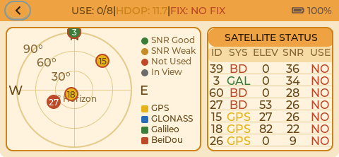

- 实时展示可见卫星的天空分布（方位/仰角）
- 按星座与信号强度着色
- 清晰标识参与定位的卫星
- 顶部 USE/HDOP/FIX 一眼定位状态

### 📶 Energy Sweep（Sub-GHz 扫描）

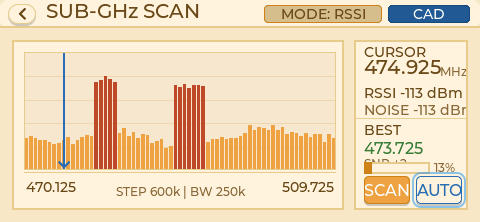

Energy Sweep 用于在野外快速观察 Sub-GHz 频段占用，辅助选频与干扰判断。

- 实时 RSSI 柱状扫描，展示当前频段能量分布
- 光标模式可读取精确频点、RSSI 与噪声底
- 提供最佳信道推荐与清洁度/SNR 提示
- `STOP/SCAN` 可暂停或继续扫描
- `AUTO` 一键应用当前最佳频点并把光标定位到推荐频率
- 扫描范围跟随当前 Region 配置（Meshtastic Region 或 MeshCore Region Preset）

### 📡 LoRa 聊天（兼容 Meshtastic + MeshCore）

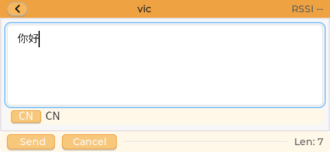

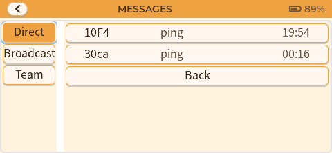

消息页展示最近会话与历史，方便快速回看。

- 基于 LoRa 的文本消息通信
- 支持中文
- 兼容 **Meshtastic 公共网络**（LongFast/PSK）
- 兼容 **MeshCore 网络**（原生 MeshCore 报文链路）
- 支持通过蓝牙连接 Meshtastic / MeshCore App
- 基于广播的通信方式（无中心基础设施）
- 面向高延迟、低带宽与丢包环境设计
- 为 ESP32 设备优化的最小协议实现

### 📷 SSTV 图片接收

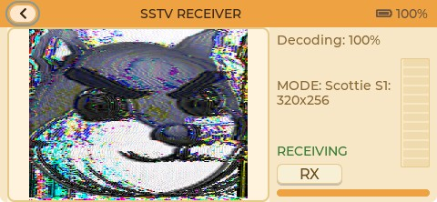


- 接收 SSTV 音频并在设备端解码成图片
- 实时解码进度与图像预览
- 面向低功耗嵌入式的解码流程

### 👥 联系人

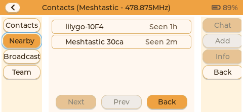

联系人页展示已发现节点、最近活动和快捷操作，
可快速进入私聊或团队聊天。

### 💻 上位机数据交换（PC Link）


PC Link 通过 USB CDC-ACM 与上位机连接，提供结构化 HostLink 数据流，
便于 APRS/iGate 集成、诊断与数据采集。

- 实时转发 LoRa 消息、团队状态与 GPS 快照
- 面向 APRS 网关/看板的扩展元数据
- 具备确定性帧格式的传输协议

### 🤝 组队模式（ESP-NOW 建队 + LoRa 运行）


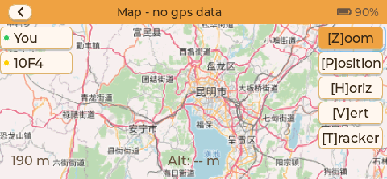

面向近距离小队场景，配对阶段使用 ESP-NOW 交换团队密钥，
建立完成后队伍内通信统一走 LoRa。

- 创建队伍（leader）或加入附近队伍（member）
- 配对阶段完成密钥分发与团队 ID 建立
- 团队聊天（文本/位置）与状态同步
- 成员列表、角色标识与人数统计
- 团队航点 / 集合点共享
- 团队地图视图展示成员位置与轨迹快照

### 🧭 轨迹记录与循迹

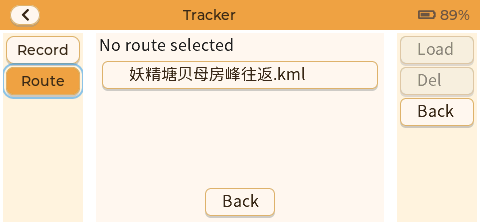

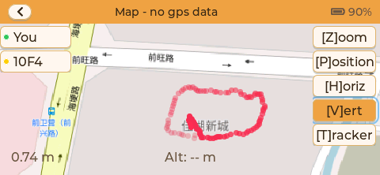

- 轨迹记录与保存（支持记录/路线模式）
- 轨迹列表浏览与轨迹聚焦
- 支持 KML 路线覆盖
- GPX 轨迹可通过 USB 大容量存储导出

### 🎙️ Walkie Talkie 对讲

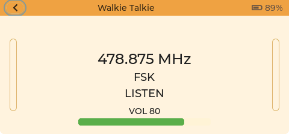

- 基于 FSK + Codec2 的语音对讲
- 半双工模式（按住说话 / 松开守听）
- 针对低带宽和丢包场景优化的缓冲与节拍

---
## 💡 设计理念

Trail-mate **不是** 智能手机的替代品，也不试图掩盖离线通信环境中的现实限制。

相反，它专注于：

- ✅ 对不确定性的诚实呈现
- ✅ 系统行为的确定性与可预测性
- ✅ 在受限硬件条件下的长期可靠运行

> 💬 **为那些简洁性与鲁棒性比"精致外观"更重要的环境而设计。**

---

## 📱 计划支持的设备

Trail Mate 的长期目标不是“尽可能支持更多板子”，而是优先支持真正适合户外离网通信的设备类别。本节描述的是 **硬件方向**，不等同于“本版本已经全部完成适配”。

当前优先考虑的设备方向包括：

- **键盘优先的 LoRa 手持终端**：例如 `T-LoRa-Pager`、`T-Deck`、`T-Deck Pro`、`Cardputer` 一类设备，适合在没有手机的情况下直接输入自由文本。
- **大屏触控导航终端**：例如 `M5Stack Tab5`、`T-Display P4` 一类设备，适合地图、团队态势、HostLink / 上位机配套等场景。
- **超低功耗 / 小屏消息终端**：例如 `nRF52 + SX1262` 这类资源更紧的设备，适合做单色 UI、状态查看、简化聊天和蓝牙桥接。

选择硬件时，项目目前主要看重以下条件：

- 具备稳定的 LoRa / Sub-GHz 无线能力，或存在清晰可接入的射频硬件路径
- 设备本身可以独立完成基本输入、查看与配置，而不是强依赖手机
- 具有可接受的功耗、供电与户外便携性
- 在社区生态、文档或供应链上相对稳定，便于长期维护

项目会尽量保持 **协议 / 存储 / UI 业务逻辑** 与具体板级实现解耦。这样未来扩展到更多 ESP32 或 nRF52 级硬件时，仍然可以继续复用 Meshtastic / MeshCore 相关能力，而不是为每块板子复制一套应用。

---

## 🧩 当前支持的设备与开发进度

下面这张表描述的是 **仓库里今天已经存在的真实构建目标**，而不是长期计划。

| 设备 / 目标 | 构建目标 | 技术路线 | 当前状态 |
| --- | --- | --- | --- |
| **LILYGO T-LoRa-Pager (SX1262)** | `tlora_pager_sx1262` | PlatformIO / Arduino | 当前默认环境，也是最完整、最适合日常开发验证的目标 |
| **LILYGO T-Deck** | `tdeck` | PlatformIO / Arduino | 当前主力验证目标，键盘、聊天、地图与共享 UI 路径已稳定接入 |
| **GAT562 Mesh EVB Pro** | `gat562_mesh_evb_pro` | PlatformIO / Arduino（nRF52） | 资源受限目标，当前重点在单色 UI、Meshtastic、BLE 与持久化链路，部分功能会按 RAM 裁剪 |
| **LILYGO T-LoRa-Pager (SX1280)** | `tlora_pager_sx1280` | PlatformIO / Arduino | 已接入的 Pager 射频变体，用于兼容不同硬件版本 |
| **LILYGO T-Deck Pro** | `tdeck_pro_a7682e` / `tdeck_pro_pcm512a` | PlatformIO / Arduino | 已有独立环境，仍处于 bring-up / 适配推进阶段 |
| **LILYGO T-Watch S3** | `lilygo_twatch_s3` | PlatformIO / Arduino | 实验性目标，偏系统与 UI 验证，不是当前完整功能验证主路径 |
| **M5Stack Tab5** | `TRAIL_MATE_IDF_TARGET=tab5` | ESP-IDF | 当前主要的大屏 IDF bring-up 目标，共享 shell 已跑通，硬件细节仍在补齐 |
| **LILYGO T-Display P4** | `TRAIL_MATE_IDF_TARGET=t_display_p4` | ESP-IDF | 早期接入目标，主要用于公共 IDF shell 与大屏路径验证 |

### 当前阶段怎么选目标

- 如果你想走今天最稳的日常开发路径，优先使用 **`tlora_pager_sx1262`** 或 **`tdeck`**。
- 如果你在做资源受限、单色屏、Meshtastic / BLE 相关调试，优先使用 **`gat562_mesh_evb_pro`**。
- 如果你在推进新的大屏触控 ESP-IDF 路线，优先使用 **`tab5`**。
- **`tdeck_pro_*`**、**`lilygo_twatch_s3`**、**`t_display_p4`** 更适合 bring-up、布局和设备适配工作，而不是当前功能完成度最高的验证入口。
- “仓库里有构建目标” 不等于 “所有页面与能力在该设备上都已达到同等成熟度”；部分功能会根据 capability、RAM 和输入设备条件动态启用或隐藏。
- GitHub Actions 当前持续构建的主路径是 **`tlora_pager_sx1262`**、**`tdeck`** 和 **`lilygo_twatch_s3`**。

---

## 🛠️ 编译方法

Trail Mate 当前主要有两条工具链路径：**PlatformIO** 和 **ESP-IDF**。下面的命令默认都在 **仓库根目录** 执行。

### PlatformIO

PlatformIO 覆盖了 ESP32 Arduino 目标，也覆盖了当前的 nRF52 Arduino 目标。根目录的 [platformio.ini](platformio.ini) 只保留共享配置，具体环境定义分散在 `variants/*/envs/*.ini`。

常用构建命令：

```bash
# 主力目标
platformio run -e tlora_pager_sx1262
platformio run -e tdeck

# nRF52 / 资源受限目标
platformio run -e gat562_mesh_evb_pro

# 其他已接入目标
platformio run -e tlora_pager_sx1280
platformio run -e tdeck_pro_a7682e
platformio run -e tdeck_pro_pcm512a
platformio run -e lilygo_twatch_s3
```

如果你需要更详细的日志，当前仓库里还提供了这些调试环境：

```bash
platformio run -e tlora_pager_sx1262_debug
platformio run -e tlora_pager_sx1280_debug
platformio run -e tdeck_debug
platformio run -e lilygo_twatch_s3_debug
```

烧录命令通用写法：

```bash
platformio run -e <env> --target upload
```

如果需要显式指定串口，可以额外加上 `--upload-port COMx`。例如：

```bash
platformio run -e tlora_pager_sx1262 --target upload --upload-port COM6
```

说明：

- 直接执行 `platformio run` 时，会使用根配置里的默认环境 **`tlora_pager_sx1262`**。
- 如果你只是想确认某个目标现在能不能编过，优先从 **`tlora_pager_sx1262`**、**`tdeck`** 或 **`gat562_mesh_evb_pro`** 开始。
- 对 GAT562 这类 RAM 很紧的目标，建议优先做发布型或低日志量验证，不要默认开启过多调试宏。

### ESP-IDF

ESP-IDF 目前主要用于新的共享 shell 路线，当前正式接入的目标是 `tab5` 和 `t_display_p4`。仓库根目录已经有顶层 `CMakeLists.txt`，可以直接在根目录执行 `idf.py`。

`tab5` 目标示例：

```bash
idf.py -B build.tab5 -DTRAIL_MATE_IDF_TARGET=tab5 reconfigure build
idf.py -B build.tab5 -DTRAIL_MATE_IDF_TARGET=tab5 -p COM6 flash
idf.py -B build.tab5 -DTRAIL_MATE_IDF_TARGET=tab5 monitor
```

`t_display_p4` 目标示例：

```bash
idf.py -B build.t_display_p4 -DTRAIL_MATE_IDF_TARGET=t_display_p4 reconfigure build
idf.py -B build.t_display_p4 -DTRAIL_MATE_IDF_TARGET=t_display_p4 build
```

### 说明

- ESP-IDF 的 `sdkconfig` 现已跟随构建目录保存，例如 `build.tab5` 或 `build.t_display_p4`，不同目标不会再互相污染配置。
- 对 **Tab5**，更建议烧录后单独执行 `monitor`；把 `flash monitor` 串在一起时，自动复位可能让 ESP32-P4 停在 ROM download mode。
- VS Code 下已经提供了 **`IDF Tab5: Reconfigure`**、**`IDF Tab5: Build`**、**`IDF Tab5: Flash`**、**`IDF Tab5: Monitor`** 等任务，入口脚本在 `tools/vscode/run_idf_task.ps1`。
- 如果你只是想做版本发布或回归验证，优先走当前 CI 覆盖的 PlatformIO 主路径；ESP-IDF 目标更适合板级 bring-up 与共享 shell 演进。

## 🌐 语言

- [English](README.md)
- [中文](README_CN.md) ← 您在这里

---

## 📝 更新日志

请查看 [CHANGELOG.md](CHANGELOG.md) 获取版本记录与计划内容。

---

## 📄 许可证

本项目采用 **GNU Affero General Public License v3.0（AGPLv3）** 进行许可。

该许可旨在确保：  
- 本项目在被修改、部署或通过网络提供服务时，其源代码保持可获得性  
- 防止核心系统在未经授权的情况下被用于闭源或商业化产品中  

### 商业许可

对于以下使用场景，**可提供单独的商业许可**：

- 商业产品或闭源系统  
- 硬件厂商的设备集成或预装固件  
- 不希望或无法遵守 AGPLv3 条款的商业应用  

如有上述需求，请联系项目作者以获取商业授权。
本仓库内容的公开不构成任何形式的默认商业授权。

详情请参阅 [LICENSE](LICENSE) 文件。

## 🔐 项目范围说明

本仓库包含 Trail Mate 项目的 **核心系统实现**，包括但不限于：

- 设备端固件  
- 离线导航与 GPS 处理逻辑  
- 基于 LoRa 的通信协议与 Mesh 行为  
- 面向受限硬件的系统交互与状态管理  

本项目 **不包含** 以下内容：

- 商业上位机软件  
- 移动端应用（iOS / Android）  
- 商业服务或平台产品  

上述周边工具可能采用不同的许可策略，并不在本仓库的许可范围内。

---

## 🤝 贡献方式

Trail Mate 的全部代码 **100% 由 AI 在人类指导下生成**。
这个项目本身也是一次关于 **“人类如何与 AI 协作完成真实工程系统”** 的长期实践。

在这里，**贡献不等同于写代码**。

### 关于贡献与版权

除非另有明确说明，所有提交至本仓库的代码与内容，
将被视为在 **AGPLv3 许可条款** 下发布。

项目当前由作者主导开发，暂不接受涉及核心架构或许可变更的贡献。
如有商业合作或深度参与意向，欢迎直接联系作者沟通。

### 谁是最重要的贡献者？

**真正最重要的贡献者，是长期处在户外环境中的使用者。**

我们尤其欢迎：

* 徒步、露营、骑行、越野、钓鱼等户外活动参与者
* 在 **无网络、低电量、恶劣环境** 中真实使用设备的人
* 可能 **不会写代码**，但对“什么有用、什么没用”有清晰直觉的人

他们的想法、困扰与判断，将成为这个系统演化的起点。

### 贡献可以是什么？

* 🧭 **真实使用场景与问题描述**

  > 在什么环境下？遇到了什么困难？现有行为哪里不合理？
* 🧠 **对功能取舍的直觉判断**

  > 哪些信息重要？哪些反而是干扰？
* 🧪 **失败经验与边界反馈**

  > 什么时候系统“不值得被信任”？
* 🔑 **用于推动 AI 生成、验证与迭代的 token 资源**

即使你 **从不直接提交代码**，
你的判断依然可以通过 AI 被转化为 **可运行、可验证的系统行为**。

### 我们如何协作？

* 人类（尤其是户外使用者）负责：
  **判断什么值得存在**
* AI 负责：
  **把这些判断转化为一致、可运行的实现**

Pull Request 依然欢迎，但它并不是唯一、也不是最重要的贡献形式。
Trail Mate 更看重 **真实环境中的判断与问题质量**，而不是代码行数。

> 注：上述贡献主要指使用反馈、场景判断与设计输入。
> 除非另有明确约定，贡献行为不构成对项目代码或商业权益的所有权主张。

> **如果一个功能在户外没有价值，它就不应该存在。**

---

## ✅ 已实现功能

### 🧭 GPS地图导航与轨迹

- 离线地图渲染（北向上/不旋转）
- 运行时底图切换：OSM / Terrain / Satellite
- 地图图层菜单支持等高线叠加开关
- 支持 OSM/Terrain 的 PNG 瓦片与 Satellite 的 JPG 瓦片
- 实时定位标记与坐标显示
- 离散缩放级别与低功耗优化
- 轨迹记录与路线模式（记录/路线列表）
- KML 路线覆盖与聚焦
- GPX 轨迹可通过 USB 大容量存储导出

### 📝 LoRa 文本通信（Meshtastic + MeshCore 兼容）

- LoRa 文本消息（支持中文）
- Meshtastic 公共网络兼容（LongFast/PSK）
- MeshCore 网络兼容（原生 MeshCore 报文链路）
- 支持通过蓝牙连接 Meshtastic / MeshCore App
- 消息历史与会话列表
- 路由确认与错误提示（可靠性诊断）
- Unishox2 解压接收支持

### 🤝 组队模式（ESP-NOW 建队 + LoRa 运行）

- 近距离 ESP-NOW 配对、密钥分发与团队 ID 建立
- 成员列表与角色标识（leader/member）
- 团队聊天（文本/位置）
- 团队地图视图与成员位置更新
- 团队航点 / 集合点共享
- 团队轨迹与状态广播

### 📷 SSTV 解码

- 接收 SSTV 音频并在设备端解码成图片
- 实时解码进度与图像预览
- 面向低功耗嵌入式的解码流程

### 👥 联系人

- 节点发现与联系人列表
- 节点信息（ID/短名/设备信息）
- 在线/离线与最近活动
- 快速进入私聊或团队聊天

### 💻 上位机数据交换（PC Link / HostLink）

- USB CDC-ACM 传输
- HostLink 帧/事件/配置支持
- LoRa/团队/GPS 数据实时转发
- APRS/iGate 所需元数据输出

### 🎙️ Walkie Talkie 对讲

- FSK + Codec2 语音对讲
- 半双工 PTT（按住说话 / 松开守听）
- 抖动缓冲与固定节拍播放

### ⚙️ 系统设置与状态

- 显示/休眠等基础设置
- GPS 与网络相关配置
- 状态栏图标与系统提示
- 截图功能（ALT 双击，保存到 SD /screen）

### 💾 USB 大容量存储

- 设备作为 U 盘挂载
- 可直接管理导出的轨迹与文件

### 🔌 系统管理

- 优雅关机
- 低功耗管理
- 运行状态监控

### 📻 Trail-mate 中继版（GAT562 Mesh EVB Pro）

- 提供面向 `GAT562 Mesh EVB Pro` 的独立固件，定位是 **Trail-mate 体系中的中继设备**，而不是普通手持终端
- 中继版已接入 Meshtastic 兼容 LoRa 收发、Text / NodeInfo / Position 处理与对应持久化链路
- 已支持通过蓝牙与 Meshtastic App 交互，完成消息、节点信息与配置相关同步
- 中继侧参数已具备远程修改与持久化保存能力
- 单色屏界面可用于查看时间、GPS、无线状态与运行诊断，适合中继设备的现场部署与维护

---
## 🚀 待开发内容

### 🔗 Meshtastic 协议兼容性增强

- [x] **GPS位置信息共享** (`meshtastic_PortNum_POSITION_APP`, `meshtastic_Position`) - 已完成，见组队模式
- [ ] **原生 Meshtastic 航点互操作** (`meshtastic_PortNum_WAYPOINT_APP`, `meshtastic_Waypoint`) - Team 内部航点 / 集合点能力已完成，但与 Meshtastic 原生 waypoint 的协议级互通仍待补齐
- [ ] **存储转发机制** (`meshtastic_PortNum_STORE_FORWARD_APP`) - 在网络不稳定的户外环境中实现离线消息存储和转发
- [ ] **网络诊断工具** (`meshtastic_PortNum_TRACEROUTE_APP`, `meshtastic_TraceRoute`) - 提供路由跟踪和连接质量评估功能
- [x] **Meshcore网络兼容** - 已支持，可切换适配器

### 🧭 GPS导航增强

- [x] **实时定位显示** - 已完成，见 GPS 地图 / 组队模式
- [x] **轨迹导出** - GPX 轨迹可通过 USB 大容量存储导出
- [ ] **轨迹回放与统计** - 轨迹回放、里程/爬升等统计信息

### 📝 聊天功能增强

- [ ] **Unishox2压缩** - 发送压缩文本消息功能，节省带宽
- [ ] **Reticulum 支持** - 用于探索可互操作的离线通信链路

### 🔌 系统功能增强

- [ ] **语言切换** - 中英文界面切换功能
- [ ] **固件更新** - 通过USB或无线方式进行固件升级

### 📻 Trail-mate 中继版联动增强

- [ ] **普通设备远程管理中继参数** - `GAT562 Mesh EVB Pro` 中继版一侧已经具备远程改参与持久化能力，但 Trail-mate 普通设备端还没有完成对应的入口、交互流程与管理页面

---
## 🙏 致谢

Trail Mate 在开发过程中，得到了来自社区与硬件厂商的实际支持。

特别感谢 **LILYGO** 为本项目提供开发板支持。
其开放的硬件生态与稳定的 ESP32 产品线，使本项目能够在真实设备上持续迭代，并验证关键设计假设。

特别感谢 **深圳市加特物联科技有限公司** (https://github.com/gat-iot) 为本项目提供设备支持。
他们提供的实际设备帮助 Trail Mate 在真实硬件上开展开发、调试与验证，进一步推动了相关功能的落地与完善。

这些支持不仅降低了原型开发的门槛，也让 Trail Mate 能够更早地接受真实使用环境的反馈。

同时，如果有 **其他硬件厂商** 认同本项目的设计理念，并希望探索设备在户外离线场景中的实际可能性，欢迎与我联系。
在条件允许的情况下，我将尽力对相关设备进行适配，并基于真实使用情况提供反馈与改进建议。

特别感谢 **dawsonjon** (https://github.com/dawsonjon) 开源的 **PicoSSTV** 项目：
https://github.com/dawsonjon/PicoSSTV 。我们的 SSTV 接收功能参考了其解码思路。
算法说明地址：https://101-things.readthedocs.io/en/latest/sstv_decoder.html

---

**为户外社区用心打造 ❤️**


# 项目声明（NOTICE）

## 关于本项目

**Trail-mate** 是一个面向离网环境的现场通信与团队态势感知系统，主要围绕低功耗无线电设备（LoRa 及兼容的 Sub-GHz 无线电）构建。

本项目关注的不是互联网消息传递，而是在人类无法依赖蜂窝网络、网络不稳定、或不适合使用公网通信的场景下，实现可靠的人与人之间的协同、位置共享与信息传递。

本仓库为持续开发中的工程项目，并非代码存档，也不是示例性质的参考实现。

如果你正在对代码进行：

* 评估
* 二次开发
* 协议分析
* 固件移植
* 产品集成
* 内部测试

建议直接联系作者沟通。

---

## 作者

**Vic Liu**

系统架构、通信协议、固件设计及参考实现均由作者长期维护与持续演进。

---

## 联系方式

* Email：**[vicliu@outlook.com](mailto:vicliu@outlook.com)**
* Discord：**[Trail Mate Discord](https://discord.gg/87PVMVUP)**
* 微信：**vicliu890624**

可以联系作者的事项包括但不限于：

* 硬件适配或移植
* 协议说明与实现细节
* 接入现有无线电系统
* 商业使用或授权咨询
* 合作开发
* 现场部署建议
* 不方便通过 Issue 描述的问题

实时技术沟通建议使用 Discord 或微信。
正式、较长内容建议使用 Email。

---

## 面向组织 / 公司

如果贵组织正在内部测试或评估本仓库：

即使仍处于可行性研究阶段，也欢迎提前沟通。
很多系统性问题在工程早期讨论，通常可以节省大量开发成本与时间。

作者可以提供：

* 硬件适配建议
* 架构说明
* 技术咨询
* 定制开发方向建议

---

## 许可说明

本项目按照 LICENSE 文件中所述的开源协议发布。

若代码被用于：

* 设备固件分发
* 网络服务
* 可再分发系统
* 商业产品

请确认你的使用方式符合许可协议要求。
如存在不确定之处，建议在部署前与作者联系。

---

## 项目意图

Trail-mate 的目标是提供一种真正可用、以人为中心的离网协同通信系统。

非常欢迎：

* 实际使用反馈
* 野外测试报告
* 部署经验
* 改进建议

你不必先提交 Issue，也可以直接联系作者。

感谢你对本项目的关注与使用。


